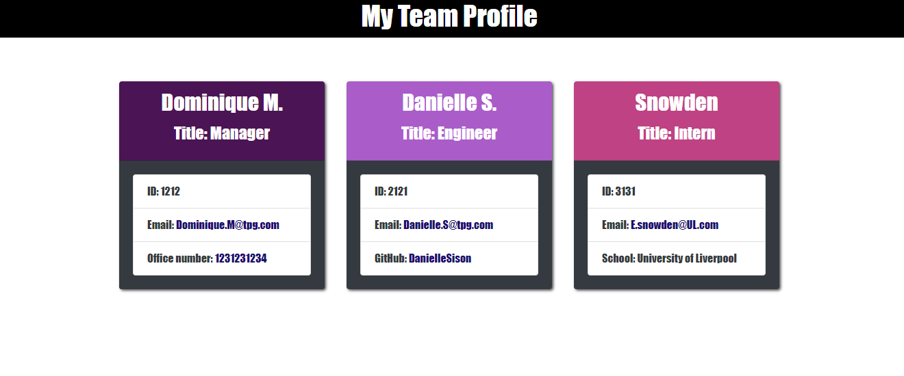

# Nux Bigas XIII

## Video Submission Link: https://drive.google.com/file/d/1YrsEKfmsnAd58WCGD87gwuMUUF4vBQ_O/view

## Description

Utilizing node.js to generate a team profile that displays all data input by user.

## Installations

Please install the following through your terminal:

```
npm i

npm i inquirer@8.2.4

npm i jest

npm i axios
```

## Usage

Please run the following through your terminal: 

```
node index.js
```

The following questions will be asked after running node index.js and the user will be prompted to answer:(Answers must be provided, your input will be validated through the CLI)

<ul>
<li>Manager:</li>
<ol>Provide team manager name.</ol>
<ol>Provide team manager ID.</ol>
<ol>Provide team manager e-mail.</ol>
<ol>Provide the team manager's phone number.</ol>
</li>
<li>Then you will be prompted to add another team member or end the application.</li>
<li>Engineer:</li>
<ol>Provide the team engineer's name.</ol>
<ol>Provide the engineer's ID.</ol>
<ol>Provide the engineer's e-mail address</ol>
<ol>Provide the engineer's GitHub username.</ol>
</li>
<li>Then you will be prompted again to add another team member or end the application.</li>
<li>Intern:</li>
<ol>Provide the intern's name.</ol>
<ol>Provide the intern's ID.</ol>
<ol>Provide the intern's e-mail address.</ol>
<ol>Please provide intern's university name.</ol>
</li>
<li>Then you will be prompted again to add another team member or end the application.</li>
<li>If end the application is chosen, and index.html shall be generated with the user's given data. </li>
</ul>


## Screenshot

Below is a screenshot of the sample team profile generated, it can also be found under the dist folder in this repository.



## Credits

The following programs / guides were used to create this project:

<ul>
<li>Node.js - https://nodejs.org/en/</li>
<li>Inquirer.js - https://www.npmjs.com/package/inquirer</li>
<li>Jest.js - https://jestjs.io/</li>
<li>Axios.js - https://axios-http.com/docs/intro</li>
</ul>

Thank you to the instructors and TA's that helped with this project.

## License

N/A


